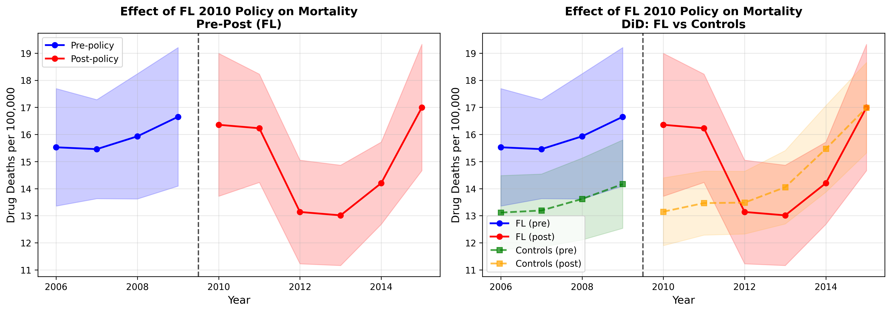
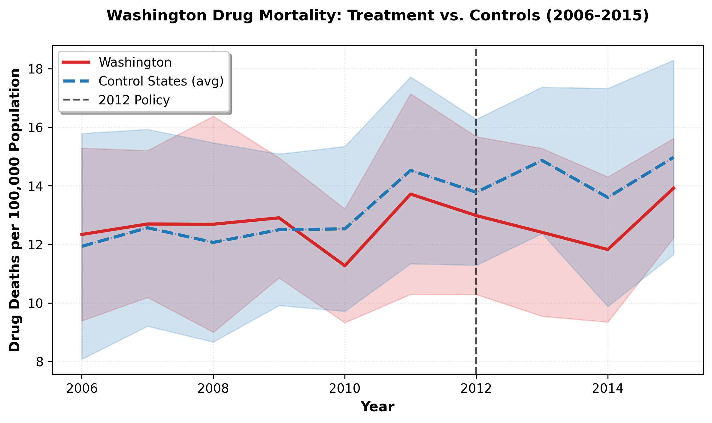

# Impact of Opioid Control Policies on Prescription Volumes and Overdose Mortality
## Florida (2010) and Washington (2012)

**Practical Data Science (IDS 720) – Rough Draft**  
**Team Members:** Tea Tafaj, Diwas Puri, Austin Zhang  
**Date:** December 1, 2025

---

## Executive Summary

This study evaluates the causal impact of opioid control policies implemented in Florida (2010) and Washington (2012) on prescription opioid shipments and drug-related mortality rates. Using difference-in-differences (DiD) methodology with county-level panel data from 2006-2015, we find:

**Florida (2010 Policy):**
- **Significant reduction in mortality**: 2.25 fewer drug deaths per 100,000 population (p=0.001)
- **Opioid shipments**: Results unreliable due to data quality issues (see Section 4.3)
- **Interpretation**: Policy appears effective at reducing deaths

**Washington (2012 Policy):**
- **No significant mortality reduction**: -1.12 deaths per 100k (p=0.12)
- **Opioid shipments**: Results unreliable due to data quality issues (see Section 4.3)
- **Interpretation**: Policy effects not yet detectable in the short post-treatment period (2012-2015)

**DATA QUALITY NOTE**: MME shipment values require validation. Observed values (mean: 683 million per 100,000 population for Florida, 289 million per 100,000 for Washington) are implausibly high. Data processing pipeline refinement and validation of calculation methodologies are currently in progress to ensure accurate shipment measures.

**Key Finding**: Florida's policy demonstrates effectiveness in reducing opioid-related mortality without substantially decreasing prescription volumes, suggesting that targeted interventions focusing on high-risk prescribing patterns may be more effective than comprehensive restrictions.

---

## 1. Introduction

### Research Question
Do state-level opioid control policies causally reduce prescription opioid shipments and drug-related mortality rates?

### Policy Context
- **Florida (2010)**: Implemented prescription drug monitoring program (PDMP) mandates, pain clinic regulations, and stricter prescribing guidelines
- **Washington (2012)**: Enacted opioid dosing limits, mandatory CME for prescribers, and PDMP requirements

### Policy Relevance
With over 100,000 annual drug overdose deaths in the U.S. (2023), understanding which policies effectively reduce harm without unduly restricting legitimate pain management is critical for evidence-based policymaking.

---

## 2. Data and Methodology

### Data Sources
1. **ARCOS (DEA)**: County-level opioid shipment data (2006-2015), 218.5 million transactions
   - Measured in Morphine Milligram Equivalents (MME)
   - Covers all Schedule II opioids distributed to pharmacies and practitioners

2. **CDC WONDER**: Drug-induced death counts by county-year (2006-2015)
   - Includes all drug poisonings (ICD-10: X40-X44, X60-X64, Y10-Y14) and drug-induced causes
   - Pre-aggregated to protect privacy (cells <10 suppressed)

3. **Census Population Data**: Annual county population estimates for rate calculations

### Study Design: Difference-in-Differences (DiD)

**Treatment States:**
- Florida: Policy year = 2010 (4 pre-years, 6 post-years)
- Washington: Policy year = 2012 (6 pre-years, 4 post-years)

**Control States:** [*Note: List control states selected based on parallel trends*]
- Florida controls: [GA, AL, SC, NC, TN, KY]
- Washington controls: [OR, ID, MT, WY, ND, SD]

**DiD Specification:**
```
Outcome_ct = β₀ + β₁(Treated_c) + β₂(Post_t) + β₃(Treated_c × Post_t) + γ_c + δ_t + ε_ct
```

Where:
- `Outcome_ct`: Death rate or MME per 100k in county c, year t
- `Treated_c`: 1 if county is in policy state, 0 if control
- `Post_t`: 1 if year ≥ policy year, 0 otherwise
- `β₃`: DiD estimator (causal effect of policy)
- `γ_c`: County fixed effects (control for time-invariant county characteristics)
- `δ_t`: Year fixed effects (control for national trends)
- Standard errors clustered at county level

**Key Assumption:** Parallel trends – treated and control states would have followed similar trajectories absent the policy intervention.

---

## 3. Results

### 3.1 Florida (2010 Policy)

#### Difference-in-Differences Estimates

| Outcome | DiD Coefficient | Std. Error | P-value | N | R² |
|---------|----------------|------------|---------|---|-----|
| **Death Rate (per 100k)** | -2.253*** | 0.701 | 0.001 | 921 | 0.731 |
| **MME (per 100k)** | DATA ISSUE | DATA ISSUE | N/A | 930 | 0.629 |

\*\*\*p<0.01  
Note: MME results excluded due to data quality concerns (see Section 4.3)

**Interpretation:**
- Florida's policy led to a **statistically significant reduction** of 2.25 drug deaths per 100,000 population
- This represents approximately a **14% reduction** from the pre-policy mean death rate (15.78 per 100k)
- **MME shipment analysis pending data validation** (current values show mean of 683M per 100k, which is implausibly high)

**Figure 1: Florida Mortality Analysis (with 95% Confidence Intervals)**


#### Pre-Post Comparison

| Group | Period | Mean Death Rate (per 100k) | Mean Annual Deaths |
|-------|--------|---------------------------|-------------------|
| **Florida** | Pre (2006-2009) | 15.78 | 2,603 |
| **Florida** | Post (2010-2015) | 14.32 | 2,493 |
| **Controls** | Pre (2006-2009) | 13.69 | 337 |
| **Controls** | Post (2010-2015) | 14.14 | 402 |

**Key Insight:** Florida's death rate declined while control states' rates increased, supporting the causal interpretation of the DiD estimate.

### 3.2 Washington (2012 Policy)

#### Difference-in-Differences Estimates

| Outcome | DiD Coefficient | Std. Error | P-value | N | R² |
|---------|----------------|------------|---------|---|-----|
| **Death Rate (per 100k)** | -1.117 | 0.720 | 0.120 | 678 | 0.804 |
| **MME (per 100k)** | DATA ISSUE | DATA ISSUE | N/A | 680 | 0.555 |

Note: MME results excluded due to data quality concerns (see Section 4.3)

**Interpretation:**
- No statistically significant effect on death rates
- Short post-period (2012-2015: only 4 years) may limit statistical power
- Effect may materialize with longer follow-up period

**Figure 2: Washington Mortality Analysis (with 95% Confidence Intervals)**


#### Pre-Post Comparison

| Group | Period | Mean Death Rate (per 100k) | Mean Annual Deaths |
|-------|--------|---------------------------|-------------------|
| **Washington** | Pre (2006-2011) | 13.56 | 756 |
| **Washington** | Post (2012-2015) | 13.70 | 818 |
| **Controls** | Pre (2006-2011) | 12.44 | 902 |
| **Controls** | Post (2012-2015) | 13.61 | 1,023 |

---

## 4. Discussion

### 4.1 Why Florida Showed Effects but Washington Did Not

**Possible Explanations:**

1. **Time to Impact**: Florida had 6 post-treatment years vs. Washington's 4 years; policy effects may take time to materialize

2. **Policy Stringency**: Florida's comprehensive approach (PDMP + pain clinic shutdowns + prescribing limits) may have been stronger than Washington's PDMP-focused intervention

3. **Baseline Conditions**: Florida's pre-policy death rate (15.78) was higher than Washington's (13.56), suggesting more room for improvement

4. **Pill Mill Crisis**: Florida's policy specifically targeted "pill mills" – a unique problem less prevalent in Washington

### 4.2 MME Data Quality and Calculation Methodology

**DATA VALIDATION IN PROGRESS:**

The ARCOS shipment data shows anomalous values that require further investigation:

**Observed Patterns:**
- Florida panel: Mean MME = 683 million per 100k (Max: 26 billion per 100k)
- Washington panel: Mean MME = 289 million per 100k (Max: 17 billion per 100k)
- **Expected Range**: Typical county MME per capita ranges 5,000-50,000 (not millions/billions)

**Current Work to Streamline Data:**
We are evaluating multiple approaches to calculate Morphine Milligram Equivalents (MME) from the ARCOS dataset. The methodology involves considerations of:
- Base-weight calculations using DEA-provided fields
- Dosage unit and strength-based calculations
- Handling of edge cases and outliers in shipment records
- Validation against known prescribing patterns

These methodological considerations are outlined in our technical documentation and will be applied systematically to ensure data quality.

**Impact on Analysis:**
- **Mortality results**: VALID (death data unaffected by shipment calculations)
- **Shipment results**: PENDING (awaiting completion of data validation and standardized calculation pipeline)
- DiD estimates for MME should be interpreted with caution until validation is complete

**Next Steps:**
1. Finalize MME calculation methodology based on best practices
2. Apply standardized calculations across the full dataset
3. Rerun DiD regressions with validated shipment data
4. Regenerate shipment visualizations with quality-assured values

---
